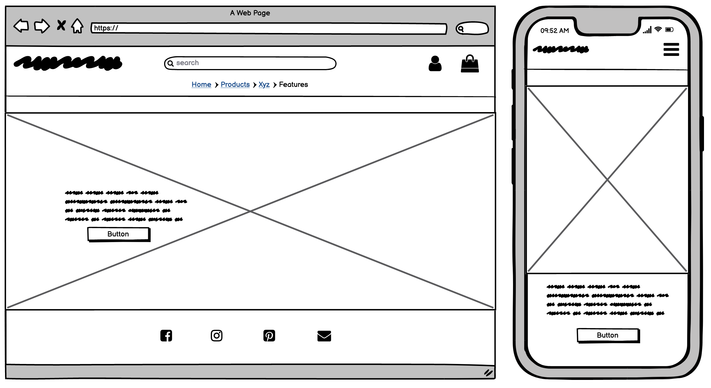
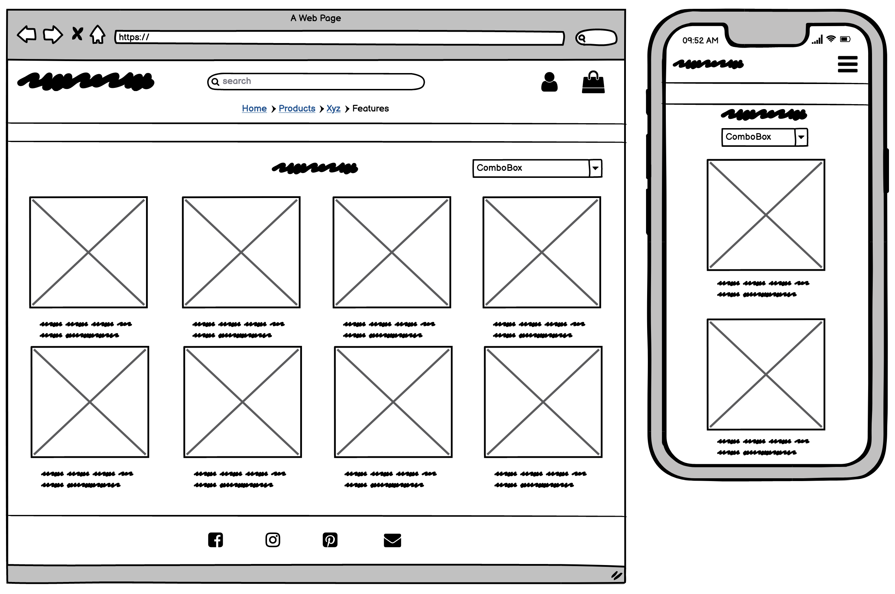
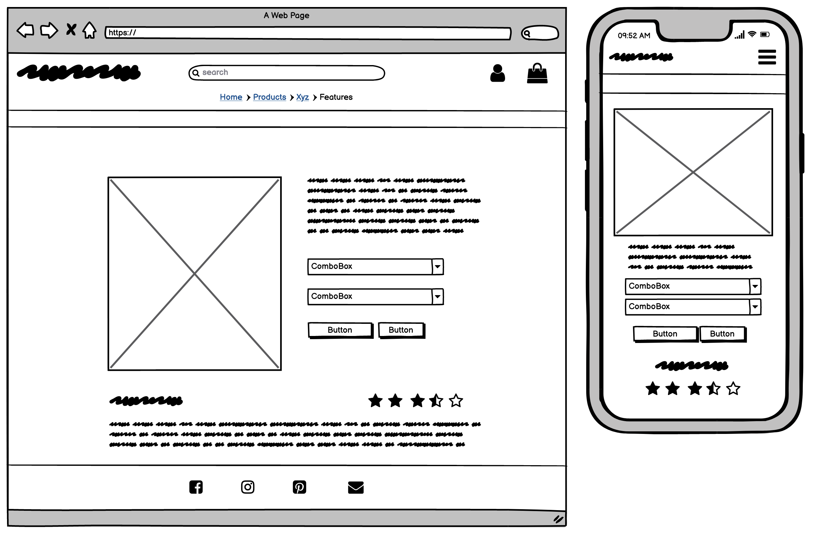
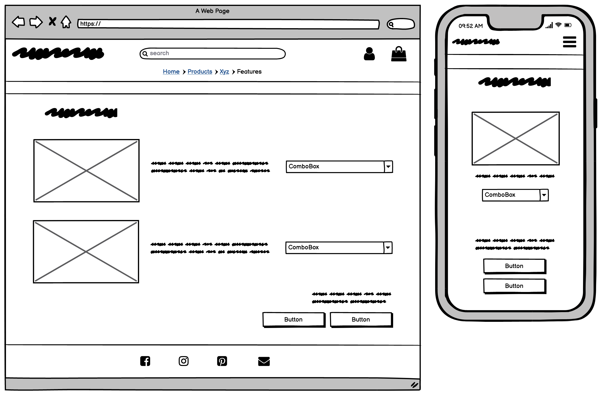
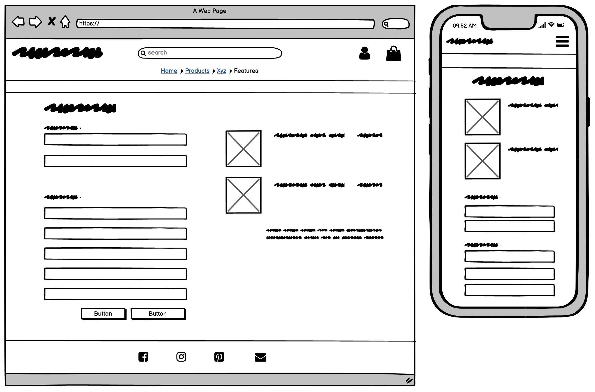
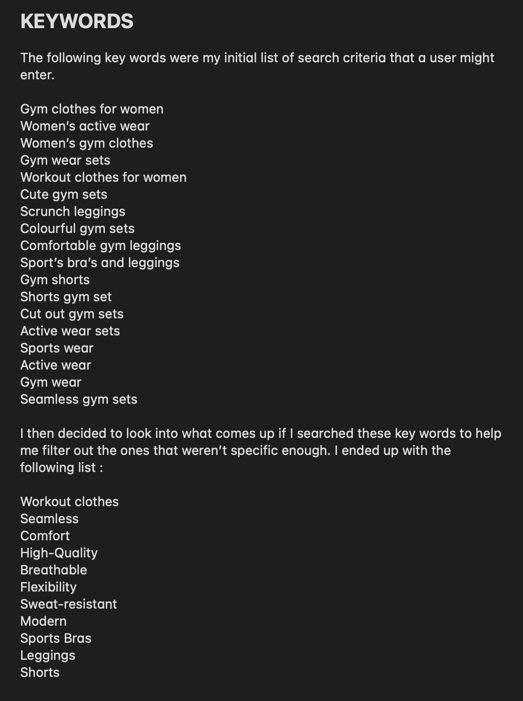
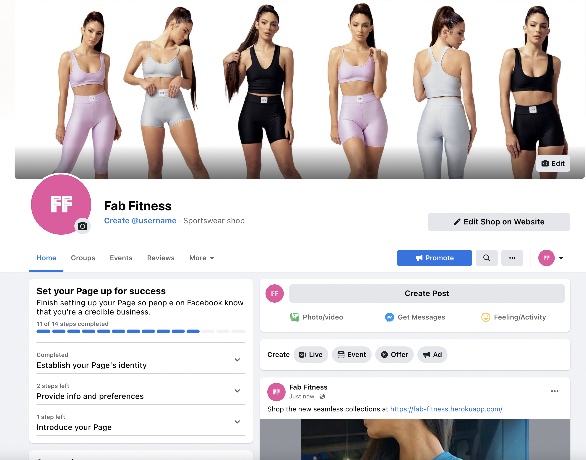
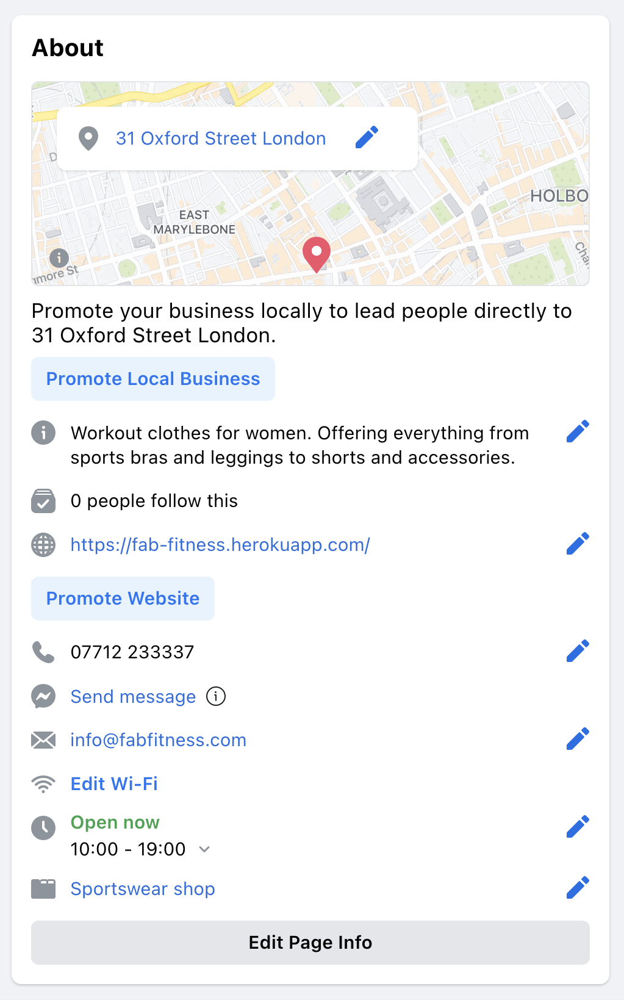
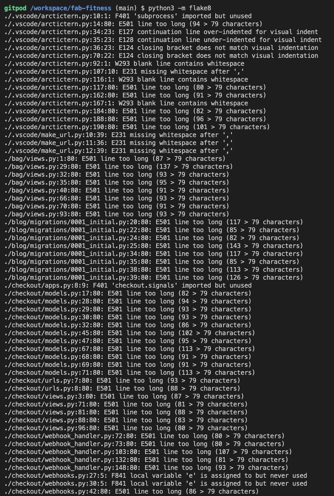

# **Fab Fitness**

[Live Site](https://fab-fitness.herokuapp.com/)


## **Introduction**
Welcome to Fab Fitness.

Fab Fitness is my fifth and final project, part of the Code Institute, Full Stack Web Developer Course.

The purpose of this project was a build a full-stack site based around a business logic used to control a centrally-owned dataset. The technologies used for this project are HTML, CSS, JavaScript, Python, and Django. Stripe handles online test payments and Heroku Postgres as a relational database.

Fab Fitness is a fictional brand, purchases on this project are accepted via Stripes test card details. For further information on which card number you should use, please refer to Stripe's official documentation.

[Stripe Test Integration](https://stripe.com/docs/testing)

This project is for educational purposes only, No commercial revenue is generated from this project.

---

## **UXD - User Experience Design**

The planning of the project is broken into 5 planes,

- The Strategy Plane
- The Scope Plane
- The Structure Plane
- The Skeleton Plane
- The Surface Plane
---

## **The Strategy Plane**

### **Creator Goals**
- As a creator, I want the site to be easy to navigate.
- As a creator, I want to allow users to filter through products.
- As a creator, I want to provide users with updates to any actions.
- As a creator, I want to allows admins to Add/Edit/Delete products to/from the store.

### **User Stories**

#### **Regular Site User Stories**
- As a site user, I want to be able to navigate across the site, so that I can view different pages on the site. 
- As a site user, I want to be able to sign up, so that I can have a personal account on the site.
- As a site user, I want to be able to receive an email confirmation after registering, so that I can verify that my account registration was successful.

#### **Customer Shopper Stories**
- As a shopper, I want to be to view all products, so that I can decide what I want to buy.
- As a shopper, I want to be able to view products in more detail.
- As a shopper, I want to be able to view reviews left by other customers for products, so that I can understand whether the product is worth purchasing. 
- As a shopper, I want to be able to see a confirmation when a product is added to my shopping bag, so that I can avoid accidentally adding multiple quantities of the same item. 
- As a shopper, I want to be able to view my bag, so that I can see what is in my bag and adjust quantities

#### **Customers (Logged in) Stories**
- As a logged-in user, I want to be able to save my details, so that I can avoid retyping my details again.
- As a logged-in user, I want to have my past orders viewable, so that I can verify what my past order was and view the order number.
- As a logged-in user, I want to be able to leave reviews on a product, so that other users may be able to benefit from my opinions on my purchase. 
- As a logged-in user, I want to be able to edit my reviews, so that I can amend any errors or in case I change my opinion.
- As a logged-in user, I want to be able to add products to my wishlist, so that I can view those products later.
- As a logged-in user, I was to be able to remove products from my wishlist, so that my wishlist is only full of products I want to be saved.

- My user stories were obtained by doing research into other stores and seeing how their sites ran.
---

## Scope
In order to achieve the desired user & business goals, the following features will be included in this release:

- Responsive navbar that will navigate to the various pages throughout the site
- Landing page with shop now button
- Products page which will be filterable
- Product details page which will have size and quantity selectors, add to bag functionality and keep shopping button
- Wishlist button and page
- Leave review option
- Blog post's and blog comments
- Register/login feature using Django allauth
- Account page where users can update their details
- Checkout page and confirmation


## **The Structure Plane**

#### **Colors**


I chose these colours as I felt that they appealed to the target audience of my website which would be young adult women. I think the bright pink helps certian features pop while the grey, black and off-white compliment the colourful aspects. 

#### **Fonts**

Google Fonts - Montserrat
- I chose Montserrat as my font throughout the project. The font is easily readable and simple. I opted to have a single font for the vast majority of the website and only styling the main header logo in Racing Sans One.


#### **Database Design**

SQLite was used during development and then Heroku Postgres in production.

[Database Diagram](media/readme/database-diagram.png)

#### **Key Models**

**UserProfile**
- The user profile is connected to the User model created by Allauth on registration.
- The default fields are saved fields by the user to speed up the checkout process by pre-populating shipping details.

**Order**
- The order model is connected to the User Profile, allows the user to view their previous orders.
- The order model acts as a container for the order line items. Although is the item is stored within the OrderLineItem model, having them connected allows to retrieve the item purchased.

**Product**
- The product model holds key information for each product. Each product has a unique ID.
- The product model is connected to the category model, this allows the user to filter products by category.

**ProductReview**
- Reviews for products can be left for products with this model, having it connect to the Product model via the ID.
- The review model also is connected to the User model to obtain the user's username. This allows the user to see the name of the user on each review. 


**WishList**
- The wishlist model allows users to save items for quicker access. These items can be removed.
- This model also acts as a container for the WishListItem model. Just like the Order model, each wishlist is unique to each user but connecting to the user ID.

**Blog**
- The blog model allows admin users to upload and display blogs.
- The blog can be edited or deleted. 

**Blog Comments**
- The blog comment model allows users that are logged in to leave a comment on a blog. 


---

## **The Skeleton Plane**

Home Page:


Products Page:


Product Details Page:


Shopping Bag Page:


Checkout Page:


---

## **The Surface Plane**

### **Features**

*Features present across the project,*

**Navigation Bar**
- Navbar is implemented on every page and is fully responsive across all resolutions.
- Users can navigate across the site freely.
- Users shopping have the cost of the current shopping basket display on large screen sizes.


**Home Page**
- Home page features a main image with a shop now button that takes users to all the products.
- Originally this page had a few images at the bottom before the shop now button however this feature had to be removed due to responsiveness issues. With more time I would have liked to improve the look of the landing page. 


**Search Functionality**
- Users can take advantage of the search function within the navigation bar to search for products or descriptions.
- Search results are shown in a simple format with a link to redirect to the general store page.


**Reviews**
- Users can choose to view the reviews left by users for a specific product.
- Logged-in users can post a review, whereas users not logged in are shown a small message to log in to leave a product review.
- User choosing the leave a review can choose to pick a title, give a star rating out of five, and write a review.

**Blog**
- Admin users can upload blog posts.
- Logged in users can leave comments on these posts.


**Toasts**
- Almost all actions provide feedback to the user via the bootstrap toasts written to provide user feedback.
- Users shopping can view the current items within the bag and total cost.  The cost of delivery is visible and the user is told how much they need to spend to get free delivery?
- At the bottom of the toast is a link to the checkout page.


**Shopping Bag**
- The shopping bag page is fully responsive, showing users a picture of the item, name, price per unit, and total price.
- Users can also choose to increase/decrease the number of items in their bag, click the update button to have the prices update.
- user can click the remove link and have all the items within the bag removed, regardless of quantity.
- At the bottom of the page user can find the cost of the bag, cost of delivery, the total and how much they must spend to be eligible for free delivery.


**Checkout Overlay**
- Users who checkout will see a simple overlay with a spinning icon while the payment is processed.


**WishList**
- Logged-in users can add an item to their wishlist in the product details view. 
- They can view their wishlish items on the wishlist page which alllows users to view the details of that specific product or remove it from their wishlist. 


**Social Media Links**
- Every page throughout the project has a footer with social media links. 
- Clicking the social media like redirect the user to the social media page in a new tab, so as not to disrupt the user experience.


---

## **Search Engine Optimization**

Keywords:


- These keywords have been implimented on the home page under "Discover the new Collections" subheading with a shop now button below. 

---

## **Marketing Types**

### Organic and paid social media marketing 

Instagram:
- The use of paid and gifted collabortions to fitness influences would be a good way to initially attracked and gain customers. 
- The use of instagram adverts and paid promotional advertising could also be benefitial especially if sales or discounts were ran. 

Facebook:
- Again the use of paid advertising would be good here. However more emphasis would be put on the Instgram advertising as this is very popular within the target audience. 

### Email Marketing 

- The use of email marketing could be benefitial as the store can target old and potential customers. 

### Facebook Page Mockup 




---

## **Technologies Used**

- [Python](https://www.python.org/) 
    - The following Python modules were used on this project, 
        - asgiref==3.4.1
        - boto3==1.18.26
        - botocore==1.21.26
        - dj-database-url==0.5.0
        - Django==3.2.5
        - django-allauth==0.41.0
        - django-countries==7.2.1
        - django-crispy-forms==1.12.0
        - django-storages==1.11.1
        - gunicorn==20.1.0
        - jmespath==0.10.0
        - oauthlib==3.1.1
        - Pillow==8.3.1
        - psycopg2-binary==2.9.1
        - pylint-django==2.4.4
        - pylint-plugin-utils==0.6
        - python3-openid==3.2.0
        - pytz==2021.1
        - requests-oauthlib==1.3.0
        - s3transfer==0.5.0
        - sqlparse==0.4.1
        - stripe==2.60.0

- [Heroku Postgres](https://www.heroku.com/postgres)

- [AWS S3](https://aws.amazon.com/)
 
- [HTML](https://developer.mozilla.org/en-US/docs/Web/HTML)

- [CSS](https://developer.mozilla.org/en-US/docs/Learn/Getting_started_with_the_web/CSS_basics)

- [Bootstrap](https://getbootstrap.com/)

- [jQuery](https://jquery.com/)

- [JavaScript](https://www.javascript.com/)

- [Google Fonts](https://fonts.google.com/)

- [Font Awesome](https://fontawesome.com/)

- [Google Developer Tools](https://developers.google.com/web/tools/chrome-devtools)

- [Github](https://github.com/)

- [Git](https://git-scm.com/)

- [Gitpod](https://www.gitpod.io/)

- [Balsamiq](https://balsamiq.com/)

- [AutoPrefixer](https://autoprefixer.github.io/)

- [Grammarly](https://www.grammarly.com/)

---

## **Testing**

### **Manual Testing**

**Navigation Bar** 
- Navigation bar is fully responsive on large/medium/small resolutions.
- At 900px, all navigation links are inline and not wrapping on another line.
- All links are correctly redirecting to the correct pages. 
- Hover CSS is correctly working, changing the color on the icon on hover.
- Signing out, correctly shows the correct dropdown options, Log in and Register.
- Signing in, correctly shows the correct dropdown options, My profile, and Logout.
- Admins, have an additional option in the dropdown menu to the Product Management page.

**Footer**
- Links redirect to the correct social media page.
- Links open in a new browser tab. 
- Users can subscribe to the newsletter by entering their email in the marketing form.

**Products**
- On loading products correctly appear in SKU order.
- Sorting functionality works, correctly sorting products by price descending or ascending.
- Products can be sorted by price, rating or category. 
- Confirm product names and prices against their fields in the database.
- Products have the correct tag.
- Tags are correctly redirecting and filtering products by category name.

**Products Details**
- Correct redirect to the correct product on clicking the product image.
- Products details are correct and match the details in the database.
- Product quantity buttons are correctly disabled when at 1 or 99.
- Add to wishlist button correctly only shows up for logged-in users.
- Leave a review button correctly only shows up for logged-in users. 
- Users are prompted to login or sign up to leave a review. 
- Links correctly work, redirecting back to the products page and adding the product to the shopping bag.


**Reviews**
- Product reviews show for the correct product, matching the database.
- Product review form correctly not showing for users not logged in, shows for logged in users. 
- Confirm only the user who created the review or superusers have the option to edit a review.
- Editing a review, edits the review, redirects to the correct section of the page.


**WishList**
- Confirm users who are not logged in do not have the option to add a product to the wishlist.
- Confirm users who are logged in do have the option to add an item to their WishList.
- Confirm users who are not logged in are redirected to the login page when clicking the WishList link.
- Products details links correctly redirects to the correct page when clicking the link on the WishList Page.
- Removing an item from the WishList working correctly, correctly reflected within the database.

**Admin**
- Only admins have access to the Product Management page on the account dropdown.
- Only admins can see the Edit/Delete buttons on the product details page.
- Only admin users can upload a blog post. 
- Product Management links correctly redirect to the add product page.
- Adding a product working correctly, the product has the correct information from the form. Correctly shows within the database.
- Editing the product, working fully, reviews are maintained for the products after editing. Details correctly reflected.
- Delete button correctly shows a modal to confirm the delete.
- Deleting a product correctly removed the product from the database, and any reviews for the products are also deleted.

**Shopping Bag**
- Shopping bag link in the navbar shows the correct value of the current bag session.
- Correct products are shown in the shopping bag.
- Adding items to the bag, and logging in after correctly retains the current bag.
- Correct totals are shown.
- Free delivery threshold correctly updates, shows correct values.

**Checkout**
- Correct items are carried over from the shopping bag to the checkout page.
- Form correctly responds to invalid inputs.
- Redirects to the checkout success page correctly.
- Stripe correctly showing 200 status webhooks for orders.

**Search Bar**
- Showing correct search for words searched.
- Adding a new product and search by its name correctly shows the product.
- User feedback is accurate.


**Firefox Inspector**

Firefox Inspector was used throughout the development of the project to test responsiveness.
Responsiveness was tested using Dev Tools to emulate the following devices,
- Iphone 5
- Iphone 6/7/8
- Iphone 6/7/8 Plus
- Iphone X
- Ipad
- Ipad Pro

**Browser Testing**

During development, the testing was mainly done solely using Firefox.

In production the site has been tested on the following browsers,
- Google Chrome
- Firefox
- Microsoft Edge
- Safari

---

### **Validation**

[W3C HTML Validator](https://validator.w3.org/)
- 0 Errors
- 0 Warnings

[W3C CSS Validator](https://jigsaw.w3.org/css-validator/)
- 0 Errors
- 702 Warnings
    - These warnings are in relation to a unknown vendor extentions that are added by CSS Autoprefixer for cross browser support.

[JSHint JavaScript Validator](https://jshint.com/)
- 0 Errors


The python extention was used to test Python for Pep8 compliance withit's built in linting too.
- Alot of the Python errors were fixed during development.
- Any errors that related to files that were auto generated by Django were left untouched.
    - Migration files.
    - Project setting.py
    - ./manage.py
    - checkout/__init__.py
- The errors relating to the variable 'e' not being used,
    - 'e' as a variable here is used to capture any errors from the Stripe webhook handler.
- ./checkout/app.py - 'checkout.signals' imported but unused
    - The import is used to let Django know there a signals module, listening for changes to automatically updating the totals
- Errors relating to lines being to long.
    - Lines in webhook_handler.py cannot be shortened without breaking the code.



## **Deployment**

The master branch of this repository is the most current version and has been used for the deployed version of the site.

The Code Institiue student template was used to create this project.

[Code Institute Full Template](https://github.com/Code-Institute-Org/gitpod-full-template)

- Click the *Use This Template* button.
- Give your repository a name, and description if you wish.
- Click the *Create Repository from Template* to create your repository. 
- Click the *Gitpod* button to create a gitpod workspace, this can take a few minutes.
- When working on project using Gitpod, please open the workspace from Gitpod, this will open your previous workspace rather than creating a new one.
Use the following commands to commit your work, 
- `git add . ` - adds all modified files to a staging area.
- `git commit -m "A short message exlaining your commit"` - commits all changes to a local repository.
- `git push` - pushes all your commited changes to your Github repository.

**Requirements**

- [Python 3](https://www.python.org/downloads/)
- [Pip](https://pypi.org/project/pip/)
- [Git](https://git-scm.com/)
- [AWS S3](https://aws.amazon.com/)

**Creating a Clone**

1. From the repository, click *Code*
2. In the *Clone >> HTTPS* section, copy the clone URL for the repository
3. In your local IDE open Git Bash
4. Change the current working directory to the location where you want the cloned directory to be made
5. Type `git clone`, and then paste the URL you copied in Step 2 - ``git clone https://github.com/Emmacharleswilson/fab-fitness.git``
6. Set the following values in a `env.py` file.
```
import os

os.environ.setdefault("SECRET_KEY", "<app secret key of your choice>")
os.environ.setdefault("DEVELOPMENT", "True")
os.environ.setdefault('STRIPE_PUBLIC_KEY', '<key generated by Stripe>')
os.environ.setdefault('STRIPE_SECRET_KEY', '<key generated by Stripe>')
os.environ.setdefault('STRIPE_WH_SECRET', '<key generated by Stripe>')
```

- Stripe keys are generated by Stripe, each individual have their own unique key values.
- *PLEASE MAKE SURE NEVER TO PUBLISH THESE KEYS, ADD THE `env.py` TO A `.gitignore` TO AVOID PUSHING KEYS TO GITHUB.*
7. Install the project requirements - `pip3 install requirements.txt`
8. Apply database migrations - `python manage.py migrate`
9. Create a superuser - `python manage.py createsuperuser`
10. The project can be run with the following - `python manage.py runserver`

**Heroku Deployment**

1. Log into Heroku
2. Create a new app, choose a location closest to you
3. Search for Heroku Postgres from the resources tab and add to your project
4. Make sure to have `dj_database_url` and `psycopg2` installed.
```
pip3 install dj_database_url
pip3 install psycopg2
```
5. Login to the Heroku CLI - `heroku login -i`
6. Run migrations on Heroku Postgres - `heroku run python manage.py migrate`
7. Create a superuser - `python manage.py createsuperuser`
8. Install `gunicorn` - `pip3 install gunicorn`
9. Create a requirements.txt file - `pip3 freeze > requirements.txt`
10. Create a `Procfile` (note the capital P), and add the following,
```
web: gunicorn moose_juice.wsgi:application
```
11. Disable Heroku from collecting static files - `heroku config:set DISABLE_COLLECTSTATIC=1 --app <your-app-name>`
12. Add the hostname to project settings.py file
```
ALLOWED_HOSTS = ['<you-app-name>.herokuapp.com', 'localhost']

```
13. Connect Heroku to you Github, by selecting Github as the deployment method and search for the github repository and pressing `connect`
14. In Heroku, within settings, under config vars select `Reveal config vars`
15. Add the following, 
```
AWS_ACCESS_KEY_ID =	<your variable here>
AWS_SECRET_ACCESS_KEY =	<your variable here>
DATABASE_URL =	<added by Heroku when Postgres installed>
DISABLE_COLLECTSTATIC =	1 
EMAIL_HOST_PASS = <your variable here>
EMAIL_HOST_USER = <your variable here>
SECRET_KEY = <your variable here>
STRIPE_PUBLIC_KEY = <your variable here>
STRIPE_SECRET_KEY = <your variable here>
STRIPE_WH_SECRET = <different from env.py>
USE_AWS = True
```
16. Go back to the Deploy tab and under Automatic deploys choose `Enable Automatic Deploys`
17. Back in your CLI add, commit and push your changes and Heroku will automatically deploy your app
```
git add .
git commit -m "Initial commit"
git push
```
18. Your deployed site can be launched by clicking `Open App` from its page within Heroku.

**AWS S3 Bucket setup**
1. Create an Amazon AWS account
2. Search for S3 and create a new bucket
    - Allow public access
3. Under Properties > Static website hosting
    - Enable
    - index.html as index.html
    - save
4. Under Permissions > CORS use the following:
```
[
  {
      "AllowedHeaders": [
          "Authorization"
      ],
      "AllowedMethods": [
          "GET"
      ],
      "AllowedOrigins": [
          "*"
      ],
      "ExposeHeaders": []
  }
]
```
5. Under Permissions > Bucket Policy:
    - Generate Bucket Policy and take note of Bucket ARN
    - Chose S3 Bucket Policy as Type of Policy
    - For Principal, enter *
    - Enter ARN noted above
    - Add Statement
    - Generate Policy
    - Copy Policy JSON Document
    - Paste policy into Edit Bucket policy on the previous tab
    - Save changes
6. Under Access Control List (ACL):
    - For Everyone (public access), tick List
    - Accept that everyone in the world may access the Bucket
    - Save changes

**AWS IAM (Identity and Access Management) setup**
1. From the IAM dashboard within AWS, select User Groups:
    - Create a new group
    - Click through and Create Group
2. Select Policies:
    - Create policy
    - Under JSON tab, click Import managed policy
    - Choose AmazongS3FullAccess
    - Edit the resource to include the Bucket ARN noted earlier when creating the Bucket Policy
    - Click next step and go to Review policy
    - Give the policy a name and description of your choice
    - Create policy
3. Go back to User Groups and choose the group created earlier
    - Under Permissions > Add permissions, choose Attach Policies and select the one just created
    - Add permissions
4. Under Users:
    - Choose a user name 
    - Select Programmatic access as the Access type
    - Click Next
    - Add the user to the Group just created
    - Click Next and Create User
5. Download the `.csv` containing the access key and secret access key.
    - **THE `.csv` FILE IS ONLY AVAILABLE ONCE AND CANNOT BE DOWNLOADED AGAIN.**

**Connecting Heroku to AWS S3**
1. Install boto3 and django-storages
```
pip3 install boto3
pip3 install django-storages
pip3 freeze > requirements.txt
```
2. Add the values from the `.csv` you downloaded to your Heroku Config Vars under Settings:
3. Delete the `DISABLE_COLLECTSTATIC` variable from your Cvars and deploy your Heroku app
4. With your S3 bucket now set up, you can create a new folder called media (at the same level as the newly added static folder) and upload any required media files to it.
    - **PLEASE MAKE SURE `media` AND `static` FILES ARE PUBLICLY ACCESSIBLE UNDER PERMISSIONS**


---

## **Credits**

**Product Images / Names / Descriptions**
- All the content relating to the products all came from the Bo+Tee and Gio websitea. 
- [Bo+Tee](https://boandtee.com/)
    - This project is made solely for educational purposes. There is no financial gain from the project. 
- [Gio](https://goi.com/en-gb)

**Code**
- A large amount of code came from the Code Institute, Boutique Ado Project.
- [Code Institute, Boutique Ado](https://github.com/Emmacharleswilson/boutique-ado)
    - Boutique Ado is a walkthrough project by Code Institute, this project gave students an introduction to Django/AWS S3/Stripe/Heroku Postgres
    - The core functionality of Nourish and Lift is all taken from the Boutique Ado project.

- [Harry-Leepz, Nourish and Lift](https://github.com/Harry-Leepz/Nourish-and-Lift)
    - Used this code as a guide when creating the wishlist and reviews models. 

- [Alice Pinch, Bake my Day](https://github.com/Alicepinch/bakemyday)
    - Used this code as a guide when creating the blog and blog comments models.


**Bootstrap**
- The Bootstrap Library was used through the project. The project used version 4.6.
- [Bootstrap](https://getbootstrap.com/docs/4.6/components/alerts/)
    - Toasts/Navigation Bar/Forms/Dropdown Menu/Buttons, the core elements mentioned are all found in the Bootstrap components section and built upon.

**Django Documentation**
- Django have amazing documentation with a tutorial project and in depth explanations on core components.
- [Django Documentation ](https://docs.djangoproject.com/en/3.2/)

## **Aknowledgements**

I would like to thank my course mentor Sandeep Aggarwal for his support and guidance throughout the course of the project and my peer Harry Dhillon for their support & feedback.